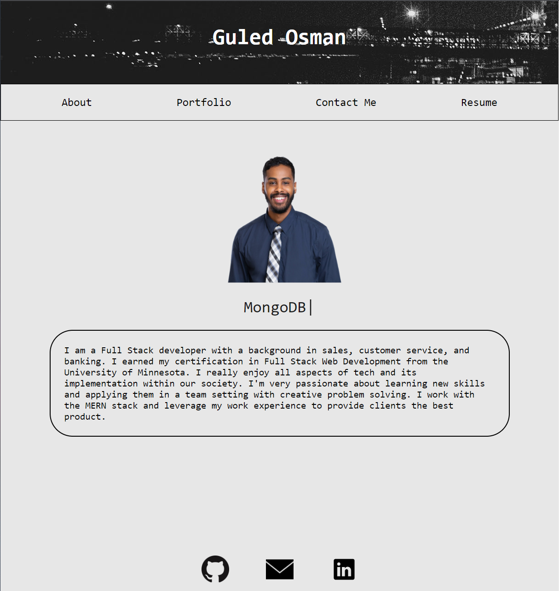

## React-Portfolio

## The Motivation

This project was a joy to do and it was the creation of my first React portfolio. This portflio uses many components to show info about me, projects, etc. 

## Challenges

There were numerous challenges with this project. Sometimes I would have the build up and its deployed successfully, but the about me DOM wouldnt load. There are many technical parts of React and its component usage that shed to light the intricacies and benefits of using this technology. 

## Screenshot

[Link to App](https://itzguled.github.io/react-portfolio/)

## License
 

